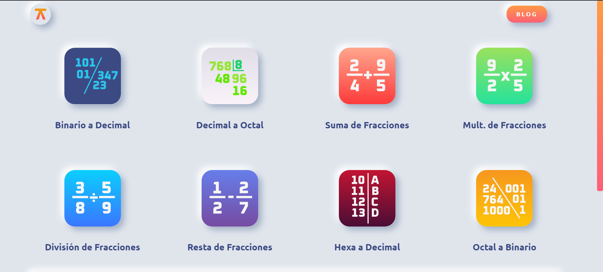
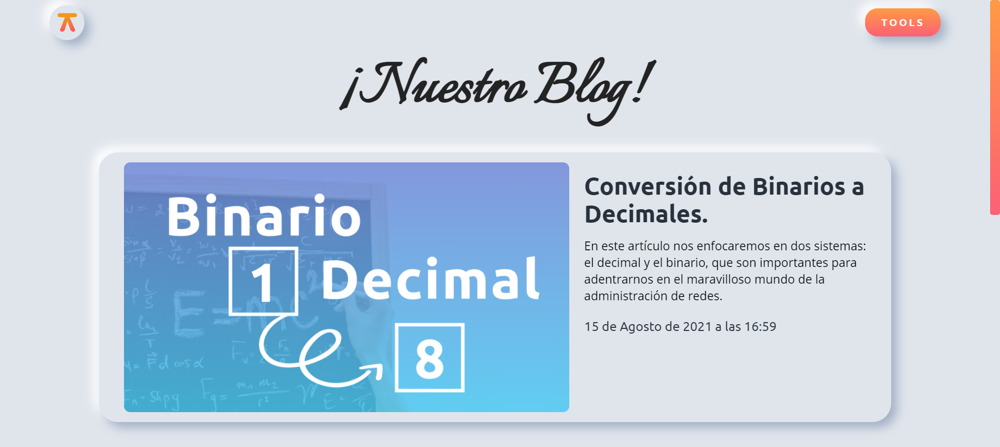
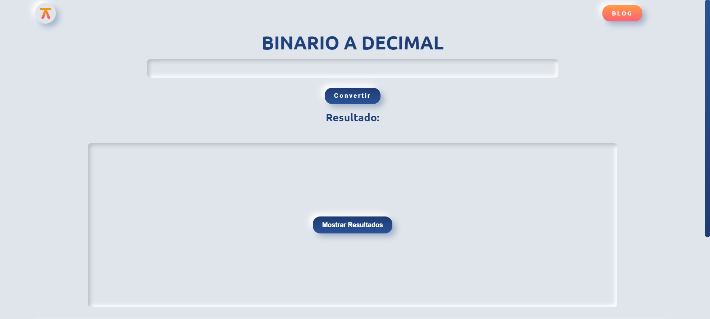
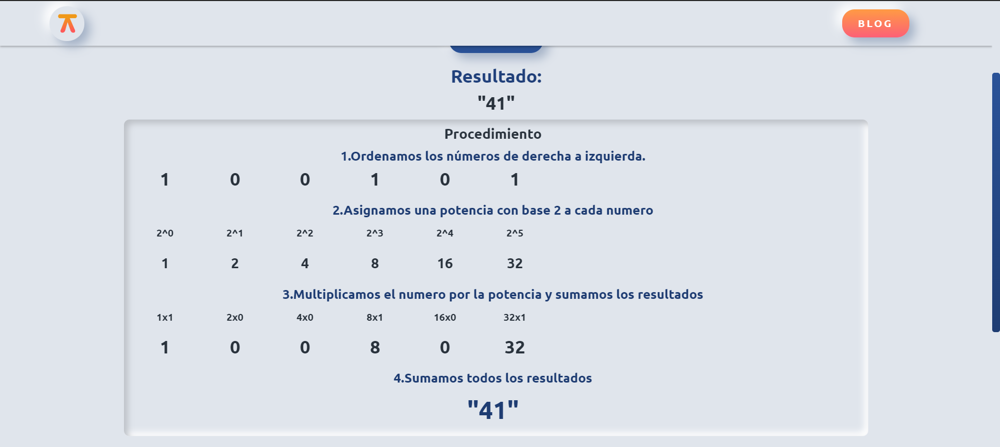

# ALGORITIME!

Esta aplicación web permite realizar la **conversión entre diferentes sistemas de numeración**, por ejemplo de Decimal a Octal.

Esta aplicación destaca por su característica de poder explicar el procedimiento de la conversión, mostrando los pasos que siguió el algoritmo para obtener el resultado.

Se desarrollo e integro al proyecto un apartado de **blog** donde se explica de una manera más amplia y con ejemplos las distintas conversiones que puede realizar la aplicación.

# Capturas

[!procedimiento conversion](sources_github/captura5.png)
